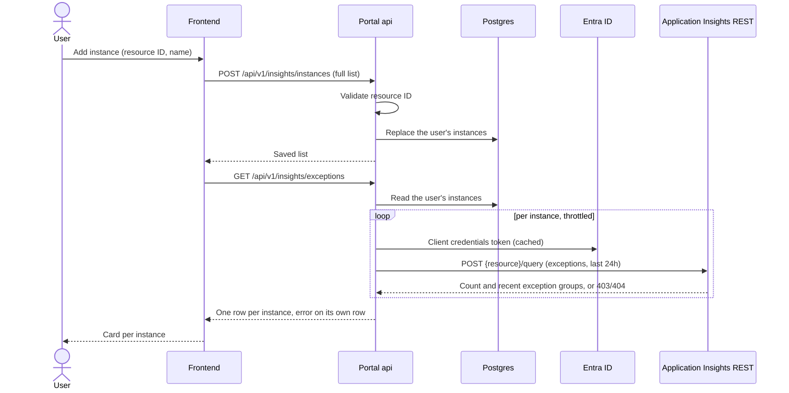

# Application Insights monitoring: sequence

```mermaid
sequenceDiagram
    actor User
    participant UI as Frontend
    participant API as Portal api
    participant DB as Postgres
    participant Entra as Entra ID
    participant AI as Application Insights REST

    User->>UI: Add instance (resource ID, name)
    UI->>API: POST /api/v1/insights/instances (full list)
    API->>API: Validate resource ID
    API->>DB: Replace the user's instances
    API-->>UI: Saved list

    UI->>API: GET /api/v1/insights/exceptions
    API->>DB: Read the user's instances
    loop per instance, throttled
        API->>Entra: Client credentials token (cached)
        API->>AI: POST {resource}/query (exceptions, last 24h)
        AI-->>API: Count and recent exception groups, or 403/404
    end
    API-->>UI: One row per instance, error on its own row
    UI-->>User: Card per instance
```
