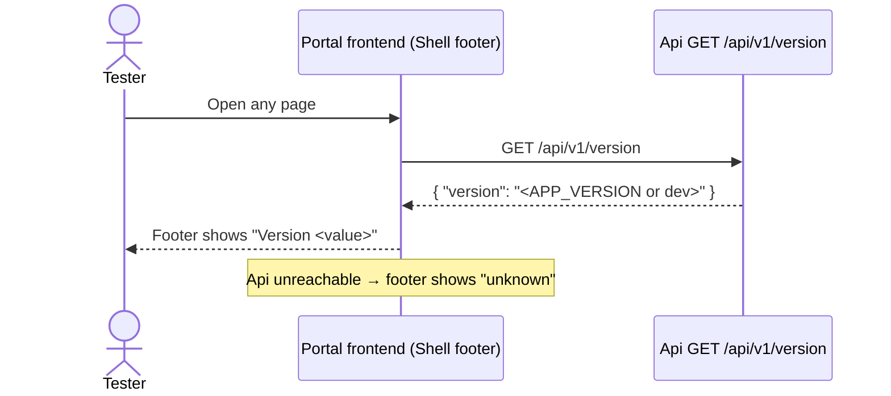

# Sequence: application version in the footer

```mermaid
sequenceDiagram
    actor Tester
    participant UI as Portal frontend (Shell footer)
    participant API as Api GET /api/v1/version

    Tester->>UI: Open any page
    UI->>API: GET /api/v1/version
    API-->>UI: { "version": "<APP_VERSION or dev>" }
    UI-->>Tester: Footer shows "Version <value>"
    Note over UI: Api unreachable → footer shows "unknown"
```
