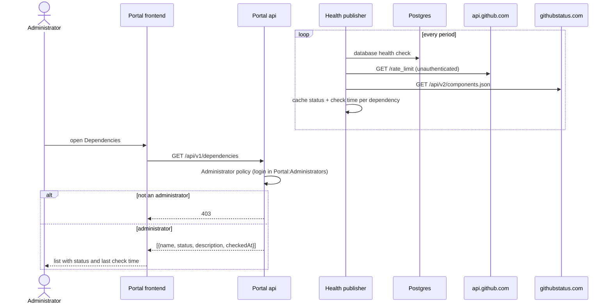

# Dependency status page — sequence

```mermaid
sequenceDiagram
    actor Admin as Administrator
    participant UI as Portal frontend
    participant API as Portal api
    participant Pub as Health publisher
    participant DB as Postgres
    participant GH as api.github.com
    participant GS as githubstatus.com

    loop every period
        Pub->>DB: database health check
        Pub->>GH: GET /rate_limit (unauthenticated)
        Pub->>GS: GET /api/v2/components.json
        Pub->>Pub: cache status + check time per dependency
    end

    Admin->>UI: open Dependencies
    UI->>API: GET /api/v1/dependencies
    API->>API: Administrator policy (login in Portal:Administrators)
    alt not an administrator
        API-->>UI: 403
    else administrator
        API-->>UI: [{name, status, description, checkedAt}]
        UI-->>Admin: list with status and last check time
    end
```
