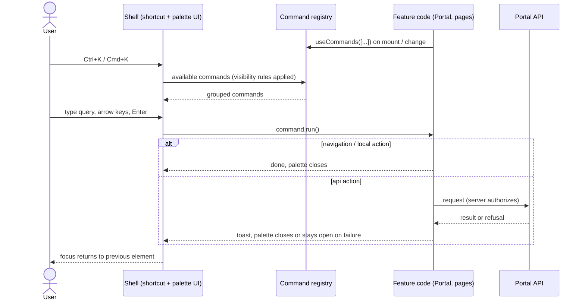

# Global command palette — sequence

```mermaid
sequenceDiagram
    actor User
    participant Shell as Shell (shortcut + palette UI)
    participant Registry as Command registry
    participant Feature as Feature code (Portal, pages)
    participant Api as Portal API

    Feature->>Registry: useCommands([...]) on mount / change
    User->>Shell: Ctrl+K / Cmd+K
    Shell->>Registry: available commands (visibility rules applied)
    Registry-->>Shell: grouped commands
    User->>Shell: type query, arrow keys, Enter
    Shell->>Feature: command.run()
    alt navigation / local action
        Feature-->>Shell: done, palette closes
    else api action
        Feature->>Api: request (server authorizes)
        Api-->>Feature: result or refusal
        Feature-->>Shell: toast, palette closes or stays open on failure
    end
    Shell-->>User: focus returns to previous element
```
