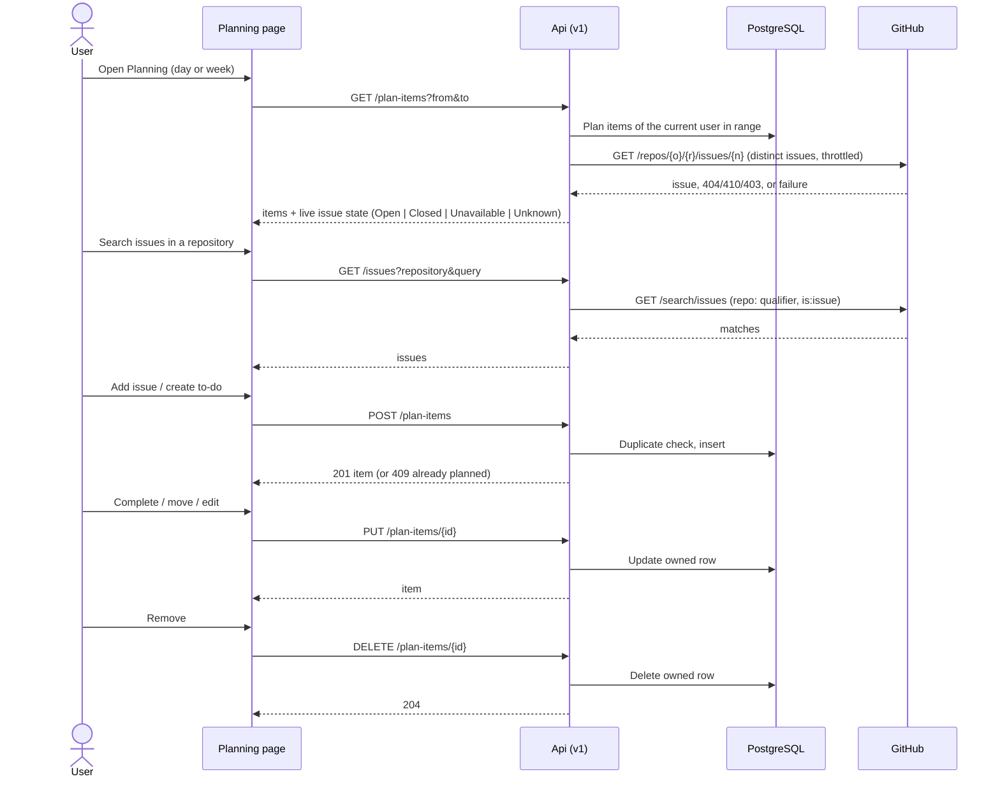

# Personal planning: sequence diagram

```mermaid
sequenceDiagram
    actor User
    participant UI as Planning page
    participant API as Api (v1)
    participant DB as PostgreSQL
    participant GH as GitHub

    User->>UI: Open Planning (day or week)
    UI->>API: GET /plan-items?from&to
    API->>DB: Plan items of the current user in range
    API->>GH: GET /repos/{o}/{r}/issues/{n} (distinct issues, throttled)
    GH-->>API: issue, 404/410/403, or failure
    API-->>UI: items + live issue state (Open | Closed | Unavailable | Unknown)

    User->>UI: Search issues in a repository
    UI->>API: GET /issues?repository&query
    API->>GH: GET /search/issues (repo: qualifier, is:issue)
    GH-->>API: matches
    API-->>UI: issues

    User->>UI: Add issue / create to-do
    UI->>API: POST /plan-items
    API->>DB: Duplicate check, insert
    API-->>UI: 201 item (or 409 already planned)

    User->>UI: Complete / move / edit
    UI->>API: PUT /plan-items/{id}
    API->>DB: Update owned row
    API-->>UI: item

    User->>UI: Remove
    UI->>API: DELETE /plan-items/{id}
    API->>DB: Delete owned row
    API-->>UI: 204
```
